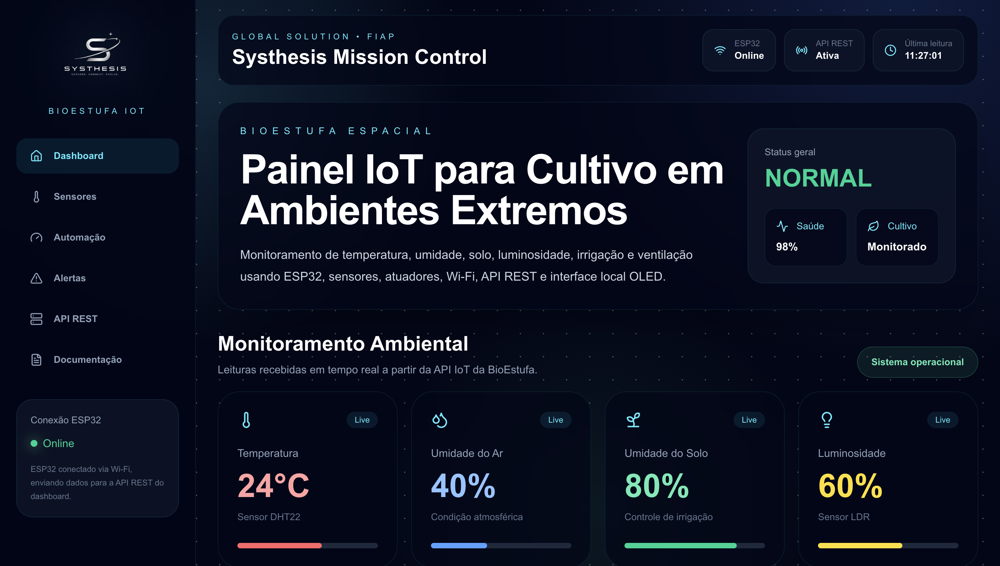
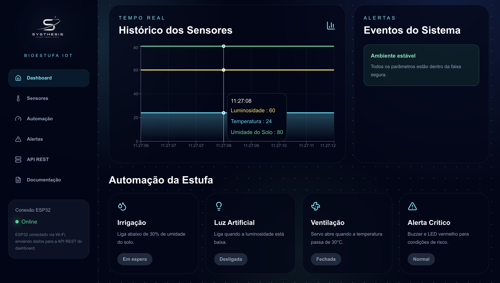
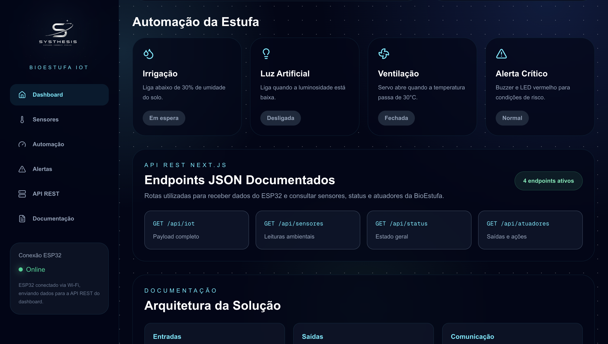
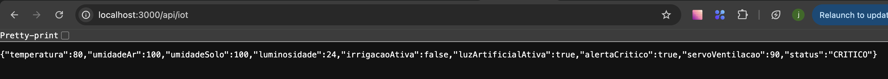
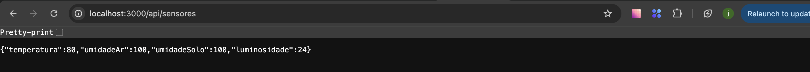
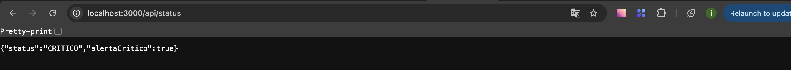
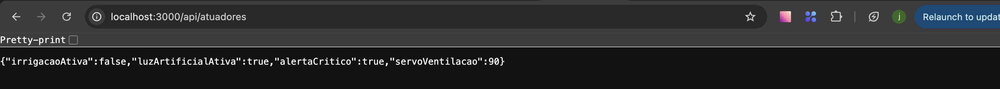

# 🚀 Systhesis BioEstufa Espacial Dashboard

## 👨‍💻 Integrantes

* João Victor Alcântara — RM562707
* Phillipo Barbosa — RM565399
* Eduardo Martins — RM562259

---

# 📌 Descrição do Projeto

O Systhesis BioEstufa Espacial Dashboard é uma plataforma web desenvolvida para monitoramento inteligente de uma bioestufa automatizada voltada para a produção de alimentos em ambientes extremos.

O sistema recebe dados em tempo real provenientes de sensores conectados a um ESP32, permitindo acompanhar as condições ambientais da estufa e visualizar o funcionamento dos mecanismos de automação.

---

# 🌎 Problema

A produção de alimentos em colônias espaciais representa um dos maiores desafios para futuras missões de longa duração.

Ambientes como a Lua e Marte exigem monitoramento constante de fatores ambientais críticos, como temperatura, umidade, luminosidade e irrigação.

O acompanhamento manual dessas variáveis torna-se inviável, exigindo sistemas inteligentes capazes de monitorar e automatizar processos essenciais para o cultivo.

---

# ✅ Solução Proposta

Foi desenvolvida uma plataforma IoT integrada capaz de:

* Monitorar temperatura
* Monitorar umidade do ar
* Monitorar umidade do solo
* Monitorar luminosidade
* Controlar irrigação automática
* Controlar ventilação
* Controlar iluminação artificial
* Exibir alertas críticos
* Disponibilizar dados através de API REST
* Exibir informações em tempo real através de um Dashboard Web

---

# 🏗️ Arquitetura da Solução

```text
Sensores
   ↓
ESP32
   ↓
Wi-Fi
   ↓
API REST Next.js
   ↓
Dashboard Web
```

---

# 🔄 Fluxo de Dados

1. Os sensores coletam dados ambientais.
2. O ESP32 processa as informações recebidas.
3. Os dados são enviados via Wi-Fi para a API REST.
4. A API atualiza os dados da BioEstufa.
5. O Dashboard consulta os endpoints JSON.
6. As informações são exibidas em tempo real para o usuário.

---

# 🛠️ Tecnologias Utilizadas

## Front-end

* Next.js
* React
* TypeScript
* Tailwind CSS
* Recharts
* Lucide React

---

## Deploy

* Vercel

---

## Integração

* API REST
* ESP32
* Wokwi
* Wi-Fi

---

# 📊 Funcionalidades

## Dashboard

* Monitoramento em tempo real
* Interface inspirada em centros de controle espacial
* Indicadores de saúde do sistema
* Status operacional da BioEstufa

---

## Sensores

* Temperatura
* Umidade do Ar
* Umidade do Solo
* Luminosidade

---

## Automação

* Irrigação automática
* Ventilação inteligente
* Luz artificial automática

---

## Alertas

* Temperatura crítica
* Solo seco
* Baixa luminosidade
* Condições críticas de operação

---

# 🔌 API REST

A API REST recebe os dados enviados pelo ESP32 e disponibiliza informações para consulta pelo Dashboard.

## POST /api/iot

Recebe os dados enviados pelo ESP32.

---

## GET /api/iot

Retorna todos os dados da BioEstufa.

---

## GET /api/sensores

Retorna:

* temperatura
* umidadeAr
* umidadeSolo
* luminosidade

---

## GET /api/status

Retorna:

* status
* alertaCritico

---

## GET /api/atuadores

Retorna:

* irrigacaoAtiva
* luzArtificialAtiva
* alertaCritico
* servoVentilacao

---

# 📄 Exemplo de Resposta

```json
{
  "temperatura": 28.5,
  "umidadeAr": 45,
  "umidadeSolo": 62,
  "luminosidade": 40,
  "irrigacaoAtiva": true,
  "luzArtificialAtiva": false,
  "alertaCritico": false,
  "servoVentilacao": 90,
  "status": "NORMAL"
}
```

---

# 📈 Estrutura do Sistema

```text
ESP32 + Sensores
        ↓
      Wi-Fi
        ↓
 API REST Next.js
        ↓
 Dashboard Web
        ↓
Monitoramento e Automação
```

---

# 🌐 Deploy

### Dashboard Online

https://gs-systhesis-io-t-dashboard.vercel.app/

---

# 📷 Evidências

## Dashboard Principal



---

## Monitoramento dos Sensores



---

## Automação



---

## API REST

Adicionar capturas dos endpoints:

* /api/iot

* /api/sensores

* /api/status

* /api/atuadores


---

# 🔗 Repositórios

## Dashboard

https://github.com/alc-joao/GS-Systhesis-IoT-Dashboard

---

## IoT

https://github.com/alc-joao/GS-Systhesis-IoT-BioEstufa

---

# 🎥 Vídeo Pitch

Adicionar link do vídeo após publicação.

---

# 📦 Entrega Final

O projeto contém:

* Dashboard Web
* ESP32
* Sensores
* Atuadores
* API REST
* Automação Inteligente
* Simulação Wokwi
* Deploy Vercel
* Integração em Tempo Real
* Documentação Técnica

---

# 🚀 Systhesis BioEstufa Espacial

Projeto acadêmico desenvolvido para a Global Solution FIAP.
